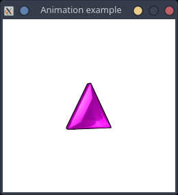
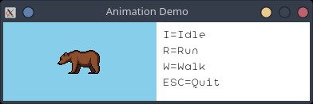
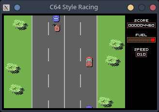

# SwinGame Pascal examples

Pascal examples for the [SwinGame library](https://github.com/macite/swingame).

## Clone this repository and build the library

```bash
git clone https://github.com/rchastain2/swingame-pascal-examples.git --recurse-submodules
cd swingame-pascal-examples
sh build-library.sh
```

## Build and run an example

```bash
cd amethyst
make
./demo
```

## Contents

### Amethyst

Simple animation example.



### Bear

Another animation example.



### Josephus

Resolution of the Josephus problem.


### Racing

C64 style racing game.


